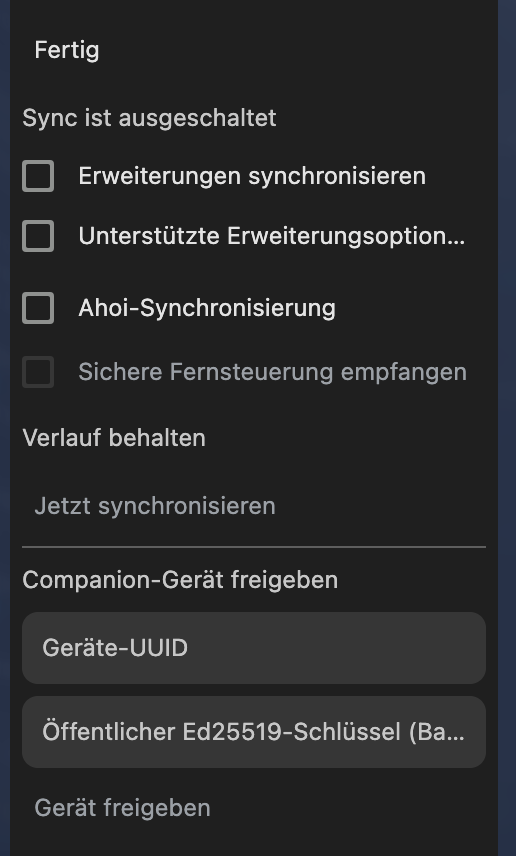

# Ahoi desktop UI / Sync directions — 13 September 2026

**Three ImageGen concepts; selection pending. NOT IMPLEMENTED / NOT E2E.**
The user rejected the position, layout and technical complexity of the sidebar
Sync form, then requested much better general UI/UX and ImageGen layouts.
These are direct refinements of the existing native Ahoi browser, not a new
web-app shell, separate sync engine or large onboarding wizard.

## Current-screen findings

1. **Entry / location — poor:** the provided screenshot shows a long setup form
   in the narrow tab sidebar. Navigation and account setup compete for the same
   space; moving configuration to normal Settings is the central improvement.
2. **Hierarchy / clarity — poor:** category switches appear above the global
   switch, while remote-control UUID and Ed25519 entry look like mandatory Sync
   setup. Separate normal automatic iCloud sync from advanced remote control.
3. **Readability — poor:** the extension option and public-key labels are visibly
   ellipsized, the retention control has no visible value, and status/action
   grouping is weak. Use readable rows, wrapping labels and clear state feedback.

This is a bounded critique of the user-provided menu screenshot, not a full
keyboard/screen-reader/contrast or multi-step runtime audit. The older whole-app
capture is contextual reference only. No user data was entered for these images.

## Generated directions — actual displayed order

1. [01-workplace.png](01-workplace.png): inline Settings with the workspace tree
   retained, grouped data/devices and one global switch.
2. [02-settings-center.png](02-settings-center.png): focused Settings navigation,
   clear first activation and readable data selection.
3. [03-browser-first.png](03-browser-first.png): ordinary browsing with compact
   toolbar Sync status and one link to full Settings; no sidebar form.

All three were generated independently with the built-in ImageGen tool and
displayed exactly once in that order. Original generated files remain under
the tool's default generated_images directory; these byte copies are durable
project artifacts. The complete prompts and source references are in
[PROMPTS.md](PROMPTS.md). Target viewport was1440×1024; images must not be
stretched or treated as exact native implementation dimensions.

Connected devices, selected categories and synchronized status in these images
are illustrative mock states, NOT proof of the current CloudKit behavior.
Generated label wording/icons are subject to existing native semantics and
consent contracts. Device provenance must only be shown when genuinely known.
Private data, cookies/passwords, unreviewed extension settings and technical
key material remain outside normal Sync UI/data scope.

Implementation waits for the user's visual selection. The existing native
Recovery/ACK crash correction proceeds independently; do not delay its safety
fix or infer that a mockup has repaired it. After selection, use native Chromium
components and the existing settings/backend rather than a parallel prototype.
