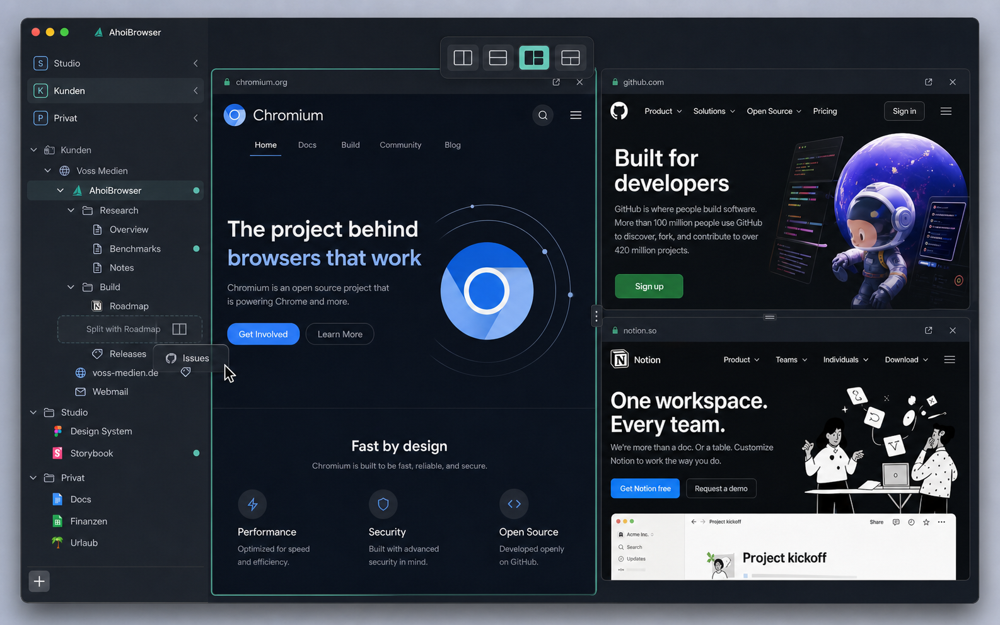

# AhoiBrowser UI concept v1

This concept is a visual target, not a pixel-perfect implementation contract.
Native Chromium behavior, accessibility, localization and measured performance
take precedence over the raster mockup.

Implementation cues:

- keep the expanded sidebar near 22 percent of a typical desktop window and
  preserve a useful collapsed mode;
- combine workspace selection, persistent links and live tabs in one vertical
  hierarchy with clear disclosure depth;
- use one restrained teal accent for selection, focus and activity rather than
  large branded surfaces;
- reuse Chromium's macOS glass frame and avoid stacked blur layers;
- keep the command bar centered, compact and keyboard-first, with only URL,
  search and classic suggestions in the initial product;
- do not add a horizontal tab strip, bookmark bar, AI affordance or dashboard.

Split-view interaction cues:

- dropping one live tab onto another exposes a clear `Split with …` target;
- support two panes side by side or stacked, all canonical three-pane layouts,
  and four panes as a coherent 2×2 grid mirrored by the sidebar;
- keep every pane live, independently focusable and resizable;
- show focus with the existing accent rather than duplicating full toolbars;
- preserve unsplit, close, audio, PiP and pane-specific DevTools actions;
- moving a split member back into the tree must not close or reload the page.

The generated webpage content and third-party icons are illustrative only and
must not ship as AhoiBrowser product assets.
